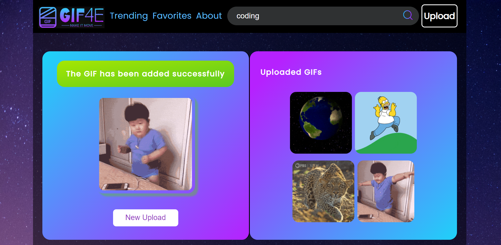

## Gif4e Documentation

1. ### Description

   Gif4e is a small vanilla JavaScript project that utilizes the Giphy API to provide users with various functionalities related to GIFs. This single-page application allows users to explore top trending GIFs, search for specific GIFs, add GIFs to favorites, and upload GIFs directly to their Giphy profile.

2. ### Project information

- Language and version: JavaScript ES2020
- Platform and version: Node 14.0+

3. ### Features

- Top Trending GIFs: Users can view the top trending GIFs fetched from the Giphy API.
- Search GIFs: Users can search for specific GIFs using keywords.
- Add to Favorites: Users can add GIFs to their favorites list for quick access.
- Upload GIFs: Users can upload GIFs directly to their Giphy profile using the Giphy API.

4. ### Installation

- Clone the repository from GitHub: https://github.com/WEB-Team-9-BDD/GIPHY-Project.git
- Open index.html in your web browser using live server.

5. ### Usage and main views

- Top Trending GIFs - Upon loading the application, users will immediately see the top trending GIFs fetched from the Giphy API. They can scroll through the GIFs to discover popular content.
  

- Search GIFs - Users can utilize the search bar to find specific GIFs by entering relevant keywords. The application will fetch GIFs matching the search query from the Giphy API and display them on the page.

- Add to Favorites 
  - If there is no gif added in favorites, a random gif appears on the page.

  - To add a GIF to favorites, users can click on the heart icon displayed on each GIF card. The GIF will then be added to the favorites list for quick access.
  

#### Upload GIFs

Users can upload GIFs directly to their Giphy profile using the provided functionality. They need to click on the upload button and follow the prompts to select the GIF file they want to upload using their file system. Once uploaded, the GIF will be visible in their Giphy profile.
The other feature provided by the application is that users can upload gif using a link, optional feature. 

#### Dependencies

Gif4e relies on the following dependencies:

Giphy API: Gif4e fetches GIF data from the Giphy API to display top trending GIFs, search for GIFs, and upload GIFs to users' profiles.
Vanilla JavaScript: Gif4e is built using plain JavaScript without any external libraries or frameworks.
HTML/CSS: The user interface is designed using HTML and styled with CSS.
